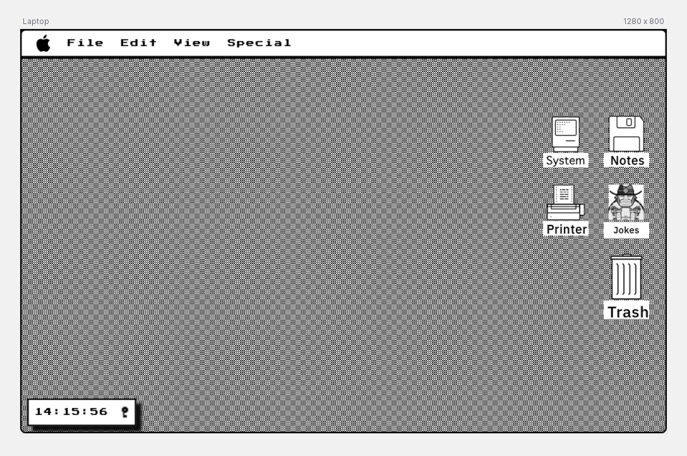
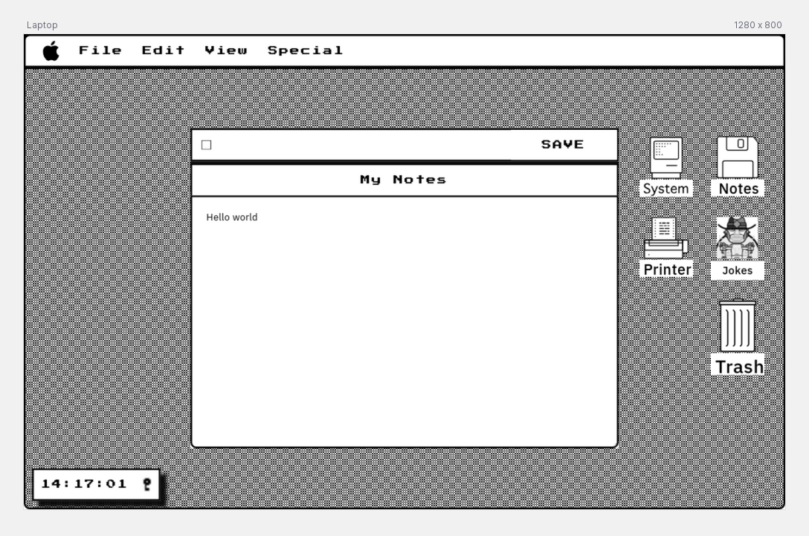
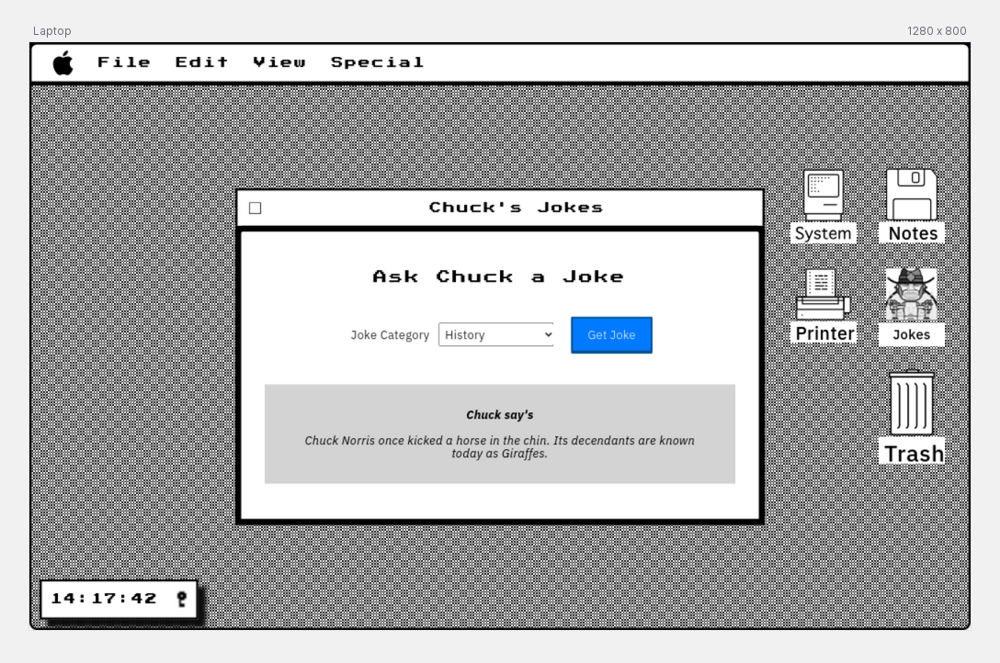
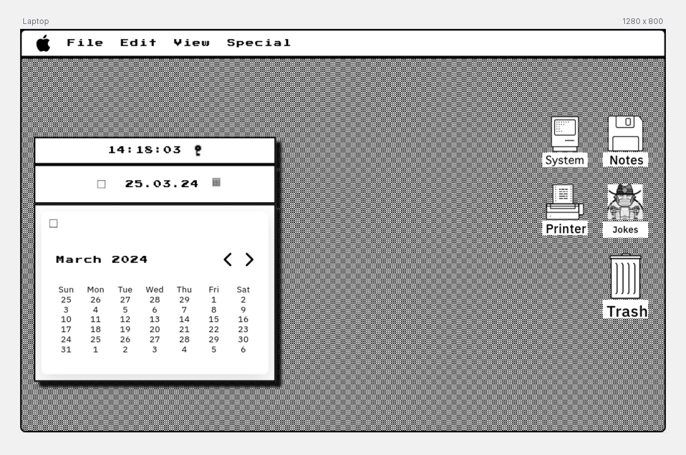

# Welcome to FakeOS!

Welcome to FakeOS, a web-based application that pays homage to the classic Macintosh OS design.

  

 
  
To experience FakeOS, visit the deployed site: https://fakeos.staceyfanner.com/

## About the Web App

FakeOS is meticulously crafted with vanilla HTML, CSS, and JS to recreate the nostalgic feel of the old-school Macintosh OS.

## Planning

### User stories

- I want to see a desktop with wallpaper that fits the viewpoint
- I want to see my current time displayed
- I want to be able to open a selectable menu which when opens displays a list of text and icons
- I want to be able to open selectable app icons which sit on my desktop
- I want to open and close my "Notes" app to write a note
- I want to save my note
- I want to open and close my "jokes" app to get a joke from a catergory of my choice
- I want to open and close my "clock" app to see the date
- I want to open and close my "date" app to see my calendar
- I want to open and close my "calendar" app to see days and months

## Key learning highlights

1. **CSS Positioning**: Deepened understanding of `position: relative` and its impact on the normal flow of items.
2. **Working with SVG Files**: Learned the nuances of SVG files compared to img tags.
3. **Modular JavaScript**: Divided JavaScript code into logic and DOM modules for improved maintainability and readability.

## Challenges

1. **Modal Interaction**: Overcame challenges in using icons to open modals by leveraging HTML custom data attributes for passing data to event listeners.
2. **Asset Selection**: Faced difficulties in sourcing the right images and font to complement the design.

## To-Dos

1. **Dynamic Icon Addition**: Implement functionality to dynamically add icons which open to stored user notes.
2. **Event Delegation**: Explore event delegation to streamline event listener functions such as `modalHandlerOpen` and `modalHandlerClose`.

## Screengrabs

| Home Page                                                     | Notes App View                                                | Jokes App View                                                | Clock App View                                                        |
| ------------------------------------------------------------- | ------------------------------------------------------------- | ------------------------------------------------------------- | --------------------------------------------------------------------- |
|  |  |  |  |

## Technologies Used

